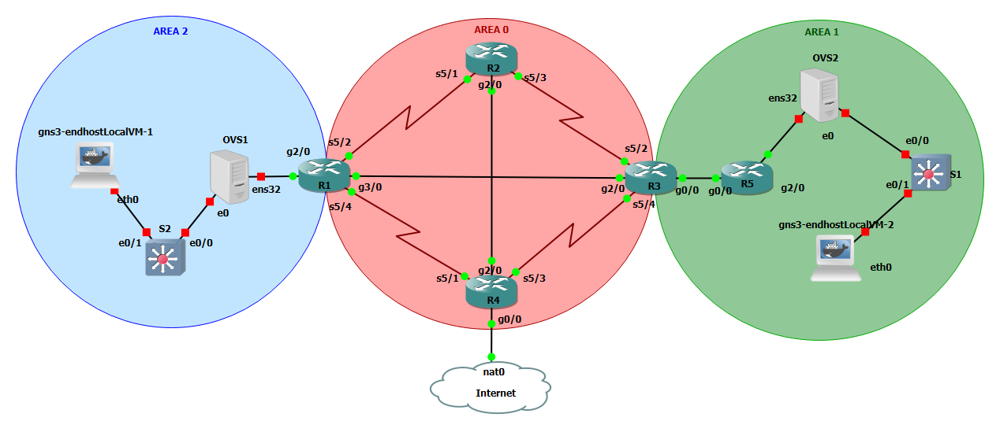

# Infrastructure finale

Ce fichier correspond à la mise en place de l'infrastructure finale pour le cours de B1.\
Les bases de l'infrastructure seront celles du [TP 6](TP_6.md) et la configuration ne sera pas entièrement détaillée à nouveau.

## Matériel

Après une bonne configuration personnalisée de gns3 on commence l'ajout et le placement du matériel.\
Ici les routeurs cisco __C3640__ sont remplacés par des __C7200__, derrière il y a des VMs __CentOS 7__ avec __OpenVSwitch__, des Switchs Cisco __vIOS__ et deux containers Docker __gns3-endhost__ pour effectuer les tests qui ne seront connectés qu'en cas de besoin.

### Adressage IP Routeurs

En premier lui pour la mise en place d'__OSPF__ il faut le plan d'adressage IP de ces équipements.\

| __Routeurs__  | `10.6.100.0/30` | `10.6.100.4/30` | `10.6.100.8/30` | `10.6.100.12/30` | `10.6.100.16/30` | `10.6.100.20/30` | `10.6.110.0/30` |
| ------------- | --------------- | --------------- | --------------- | ---------------- | ---------------- | ---------------- | --------------- |
| `r1.at.final` | `10.6.100.1`    | `10.6.100.5`    | -               | -                | `10.6.100.17`    | -                | -               |
| `r2.at.final` | `10.6.100.2`    | -               | `10.6.100.9`    | -                | -                | `10.6.100.21`    | -               |
| `r3.at.final` | -               | -               | `10.6.100.10`   | `10.6.100.14`    | `10.6.100.18`    | -                | -               |
| `r4.at.final` | -               | `10.6.100.6`    | -               | `10.6.100.13`    | -                | `10.6.100.22`    | -               |
| `r5.at.final` | -               | -               | -               | -                | -                | -                | `10.6.110.1`    |

Et également les aires __OSPF__.

| Réseaux          | `area 0` | `area 1` | `area 2` | Commentaire                  |
| ---------------- | -------- | -------- | -------- | ---------------------------- |
| `10.6.100.0/30`  | X        | -        | -        | Liaison entre `r1` et `r2`   |
| `10.6.100.4/30`  | X        | -        | -        | Liaison entre `r1` et `r4`   |
| `10.6.100.8/30`  | X        | -        | -        | Liaison entre `r2` et `r3`   |
| `10.6.100.12/30` | X        | -        | -        | Liaison entre `r3` et `r4`   |
| `10.6.100.16/24` | X        | -        | -        | Liaison entre `r1` et `r3`   |
| `10.6.100.20/24` | X        | -        | -        | Liaison entre `r2` et `r4`   |
| `10.6.101.0/30`  | -        | X        | -        | Liaison entre `r3` et `r5`   |
| `10.6.x.x/30`    | -        | X        | -        | Liaison entre `r5` et `OVS1` |
| `10.6.x.x/30`    | -        | -        | X        | Liaison entre `r1` et `OVS2` |

### Topologie

