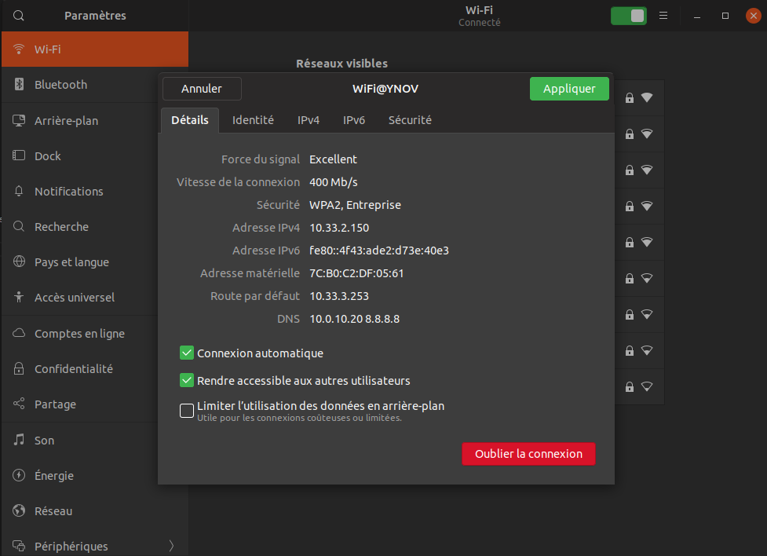

# TP 2

## I

### 1)

#### En ligne de commande

    Carte Wifi :
        Nom : wlp2s0
        Adresse MAC : 7c:b0:c2:df:05:61
        Adresse IP : 10.33.2.150
        Adresse Réseau : 10.33.0.0
        Gateway : 10.33.3.253 (Nom DNS : _gateway)

    Carte Ethernet :
        Nom : enp3s0f1
        Adresse MAC : 70:4d:7b:35:a4:8f
        Adresse IP : Pas d'adresse car la carte n'est pas connectée

#### En graphique

    

    

### 2)

#### A. Modification d'adresse IP - pt. 1

    J'ai choisi l'adresse 10.33.3.241 au hasar en respectant la plage d'ip utilisable sur le réseau d'Ynov:
        Adresse Réseau : 10.33.0.0
        Masque du Réseau : 255.255.252.0 (/22)
        Adresses utilisables : 10.33.0.1 ->  10.33.3.254 (il faut enlever ensuite une adresse pour la passerelle, ici 10.33.3.253 ainsi que d'autres adresses réservées que l'on ne connait pas actuellement)

#### B. `nmap`

    Aujourd'hui avec nmap je n'ai trouvé aucune ip utilisée (nmap étant visiblement bloqué par le réseau Ynov, voir photo).
    Par chance l'IP que j'ai choisi à la question précédente était visiblement inutilisée, j'ai utiliser la passerelle trouvée dans les questions précédentes (10.33.3.253).

