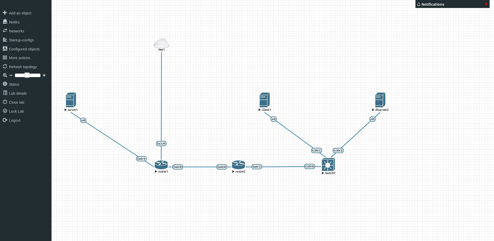

# TP5

## I. Préparation du lab

### 1. Préparation VMs

On fait correspondre la machines à la configuration demandée en paramétrant une nouvelle carte "host-only" permettant la connexion SSH.
Ensuite on clone le patron pour avoir 3 VMs et on les joute dans gns3 en précisant qu'il y a 2 interfaces réseau.

### 2. Préparation Routeurs Cisco

On importe l'image qui va servire pour mettre en place les 2 routeurs.
Le réseau a utilisé pour les routeurs peut être 10.5.3.0/30 pour utilisé les ip 10.5.12.1 et 10.5.12.2 pour les deux routeurs.

Récapitulation des IPs:

| Machines       |    net1    |    net2    |    net3   |
|----------------|:----------:|:----------:|:---------:|
| client1.tp5.b1 |      X     |  10.5.2.10 |     X     |
| client2.tp5.b1 |      X     |  10.5.2.11 |     X     |
| router1.tp5.b1 | 10.5.1.254 |      X     | 10.5.12.1 |
| router2.tp5.b1 |      X     | 10.5.2.254 | 10.5.12.2 |
| server1.tp5.b1 |  10.5.1.10 |      X     |     X     |

## II. Lancement et configuration du lab

### Checklist IP VMs

La désactivation de SELinux, les installation et la désactivation de la carte ont été fait dans lors de la préparation des VMs.
Il faut ensuite définir les IPs statiques, les noms de domaines et avoir une connexion ssh fonctionnelle, pour ce il faut suivre la procédure indiquée. comme dans les TPs précédents.

### Checklist IP Routeurs

Pour la définition des IPs statiques et des noms de domaines des routeurs `router1.tp5.b1` et `router2.tp5.b1` il faut également suivre la procédure indiquée.

*Hier je n'ai pas fait mon push après mon commit et en faisant une mise à jour pour simplifier mon ordi s'est éteint et comme je voulais KDE je me suis dit que j'avais rien de très important sur mon dualboot donc petite réinstallation aujourd'hui1 et je viens juste de voir qu'il me manquait mon joli passage bien détaillé jusqu'à la fin de la checklist des routes. Mais saches que j'avais fait un bel effort mais comme j'ai bien avancé je vais passer un peu rapidement sur cette partie du rendu pour avoir le temps d'avancer la pratique*.

Pour le `router1`:

```cisco
(config-if)# ip address 10.5.1.254 255.255.255.0
```

```cisco
(config-if)# hostname router1.tp5.b1
```

### Checklist routes

- [ ] `router1`:

  ```cisco
  (config)# ip route 10.5.2.0 255.255.255.0 10.5.12.2
  ```

- [ ] `server1`:

  - Routes

    ```bash
    [root@server1 ~]# ip route add 10.2.0.0/24 via 10.2.0.254 dev eth0
    ```

    Temporaire

    ```bash
    [root@server1 ~]# nano /etc/sysconfig/network-scripts/route-eth0

    10.2.0.0/24 via 10.2.0.254 dev eth0
    ```

    Définitif
  
  -`Hosts`

    ```bash
    [root@server1 ~]# nano /etc/hosts
  
    10.5.2.10 client1 client1.tp5.b1
    10.5.2.11 client2 client2.tp5.b1
    ```

Depuis `client2`:

```bash
[root@client2 ~]# ping client1.tp5.b1 -c 2 && echo &&  ping server1.tp5.b1 -c 2
PING client1 (10.5.2.10) 56(84) bytes of data.
64 bytes from client1 (10.5.2.10): icmp_seq=1 ttl=64 time=4.83 ms
64 bytes from client1 (10.5.2.10): icmp_seq=2 ttl=64 time=6.53 ms

--- client1 ping statistics ---
2 packets transmitted, 2 received, 0% packet loss, time 1001ms
rtt min/avg/max/mdev = 4.830/5.683/6.537/0.856 ms

PING server1 (10.5.1.10) 56(84) bytes of data.
64 bytes from server1 (10.5.1.10): icmp_seq=1 ttl=62 time=33.7 ms
64 bytes from server1 (10.5.1.10): icmp_seq=2 ttl=62 time=27.9 ms

--- server1 ping statistics ---
2 packets transmitted, 2 received, 0% packet loss, time 1002ms
rtt min/avg/max/mdev = 27.911/30.842/33.774/2.936 ms
```

## III. DHCP

### 1. Mise en place du serveur DHCP

#### 1. Renommer la machine

```bash
[root@client2 ~]# hostname dhcp-net2.tp5.b1
```

```bash
[root@client2 ~]# nano /etc/hostname
hostname dhcp-net2.tp5.b1
```

#### 2. Installer le serveur DHCP

La carte NAT (eth2) est déjà présente pour la réinstallation des VMs sur eve-ng il suffit donc de l'activer `ifup eth2`

```bash
[root@client2 ~]# ip a show dev eth2
4: eth2: <BROADCAST,MULTICAST,UP,LOWER_UP> mtu 1500 qdisc pfifo_fast state UP group default qlen 1000
    link/ether 00:50:00:00:05:02 brd ff:ff:ff:ff:ff:ff
    inet 192.168.20.17/24 brd 192.168.20.255 scope global noprefixroute dynamic eth2
       valid_lft 7143sec preferred_lft 7143sec
    inet6 fe80::250:ff:fe00:502/64 scope link
       valid_lft forever preferred_lft forever
```

Ensuite il faut installer les paquets pour le serveur dhccp:

```bash
[root@dhcp-net2 ~]# yum install -y dhcp
```

```bash
[root@dhcp-net2 ~]# ifup eth0 && ifdown eth2
```

#### 5. Démarrer le serveur DHCP

Après avoir modifié le fichier de configuration:

```bash
[root@dhcp-net2 ~]# systemctl start dhcpd
```

Pour le démarrage automatique:

```bash
[root@dhcp-net2 ~]# systemctl enable dhcpd
```

Pour vérifier que le service est démarré:

```bash
[root@dhcp-net2 ~]# systemctl status dhcpd -l
● dhcpd.service - DHCPv4 Server Daemon
   Loaded: loaded (/usr/lib/systemd/system/dhcpd.service; enabled; vendor preset: disabled)
   Active: active (running) since mer. 2019-02-20 17:27:20 CET; 2min 48s ago
     Docs: man:dhcpd(8)
           man:dhcpd.conf(5)
 Main PID: 3881 (dhcpd)
   Status: "Dispatching packets..."
   CGroup: /system.slice/dhcpd.service
           └─3881 /usr/sbin/dhcpd -f -cf /etc/dhcp/dhcpd.conf -user dhcpd -group dhcpd --no-pid

févr. 20 17:27:20 dhcp-net2.tp5.b1 dhcpd[3881]: Listening on LPF/eth0/00:50:00:00:05:00/10.5.2.0/24
févr. 20 17:27:20 dhcp-net2.tp5.b1 dhcpd[3881]: Sending on   LPF/eth0/00:50:00:00:05:00/10.5.2.0/24
févr. 20 17:27:20 dhcp-net2.tp5.b1 dhcpd[3881]: Sending on   Socket/fallback/fallback-net
févr. 20 17:27:20 dhcp-net2.tp5.b1 systemd[1]: Started DHCPv4 Server Daemon.
```

#### 6. Faire un test

En utilisant la VM `client1.tp5.b1`:

- Modification du fichier `/etc/sysconfig/network-scripts/ifcfg-eth0` pour une modification permanante
- `dhclient -v` pour demander une adresse ip immédiatement lors de la première utilisation ou `dhclient -v -r` si l'adresse IP de la carte a déjà été donné par le serveur DHCP.

```bash
[root@client1 ~]# dhclient -v eth0
Internet Systems Consortium DHCP Client 4.2.5
Copyright 2004-2013 Internet Systems Consortium.
All rights reserved.
For info, please visit https://www.isc.org/software/dhcp/

Listening on LPF/eth0/00:50:00:00:04:00
Sending on   LPF/eth0/00:50:00:00:04:00
Sending on   Socket/fallback
DHCPDISCOVER on eth0 to 255.255.255.255 port 67 interval 3 (xid=0x6ad2d7)
DHCPREQUEST on eth0 to 255.255.255.255 port 67 (xid=0x6ad2d7)
DHCPOFFER from 10.5.2.11
DHCPACK from 10.5.2.11 (xid=0x6ad2d7)
bound to 10.5.2.50 -- renewal in 254 seconds.
```

### 2. Explorer un peu DHCP

On va effectuer un `dhcpclient -v -r` pendant une capture afin de récupérer les trames correspondant au serveur DHCP:

```bash
[root@client1 ~]# dhclient -r
```

Les trames en provenance de l'adresse MAC `50:00:00:07:00:01` correspondents à la carte `eth1` qui n'a jamais été utilisé pendant le TP:

```bash
[root@client1 ~]# ip a s dev eth1
3: eth1: <BROADCAST,MULTICAST,UP,LOWER_UP> mtu 1500 qdisc pfifo_fast state UP group default qlen 1000
    link/ether 00:50:00:00:04:01 brd ff:ff:ff:ff:ff:ff
```

Lien vers le [fichier de capture Wireshark](./TP5/capture_dhcp.pcapng).

Sur le fichier de capture on peut observer les trames entre le serveur et le client DHCP (`client1.tp5.b1` et `dhcp-net2.tp5.b1`).

## IV. Bonus

### 1. Installer un serveur web

#### 1.1 Installation du serveur

Sur le `server1.tp5.b1`

```bash
# Allumer l'interface NAT
ifup eth2

# Installation de nginx
yum install -y nginx

# Ouverture du port firewall
firewall-cmd --add-port=80/tcp
firewall-cmd --reload

# Lancement du serveur web
systemctl start nginx

# Eteindre l'interface NAT
ifdown eth2
```

Vérification:

```bash
[root@server1 ~]# systemctl status -l nginx
● nginx.service - The nginx HTTP and reverse proxy server
   Loaded: loaded (/usr/lib/systemd/system/nginx.service; disabled; vendor preset: disabled)
  Drop-In: /etc/systemd/system/nginx.service.d
           └─override.conf
   Active: active (running) since mer. 2019-02-20 19:13:07 CET; 1min 2s ago
  Process: 7182 ExecStartPost=/bin/sleep 0.1 (code=exited, status=0/SUCCESS)
  Process: 7179 ExecStart=/usr/sbin/nginx (code=exited, status=0/SUCCESS)
  Process: 7177 ExecStartPre=/usr/sbin/nginx -t (code=exited, status=0/SUCCESS)
  Process: 7175 ExecStartPre=/usr/bin/rm -f /run/nginx.pid (code=exited, status=0/SUCCESS)
 Main PID: 7181 (nginx)
   CGroup: /system.slice/nginx.service
           ├─7181 nginx: master process /usr/sbin/ngin
           └─7183 nginx: worker proces

févr. 20 19:13:07 server1.tp5.b1 systemd[1]: Stopped The nginx HTTP and reverse proxy server.
févr. 20 19:13:07 server1.tp5.b1 systemd[1]: Starting The nginx HTTP and reverse proxy server...
févr. 20 19:13:07 server1.tp5.b1 nginx[7177]: nginx: the configuration file /etc/nginx/nginx.conf syntax is ok
févr. 20 19:13:07 server1.tp5.b1 nginx[7177]: nginx: configuration file /etc/nginx/nginx.conf test is successful
févr. 20 19:13:07 server1.tp5.b1 systemd[1]: Started The nginx HTTP and reverse proxy server.
```

#### 1.2 Test depuis le `client1.tp5.b1`

```bash
[root@client1 ~]# curl server1.tp5.b1 > curl
  % Total    % Received % Xferd  Average Speed   Time    Time     Time  Current
                                 Dload  Upload   Total   Spent    Left  Speed
100  3700  100  3700    0     0  15210      0 --:--:-- --:--:-- --:--:-- 15352
```

[Sortie Curl avec formatage Markdown](./TP5/curl.md)

### 2. Clé SSH

#### 2.1 Sur `client1.tp5.b1`

Création des clés publique et privée:

```bash
[root@client1 ~]# ssh-keygen
```

```bash
[root@client1 ~]# ls ~/.ssh/
id_rsa  id_rsa.pub
```

`id_rsa` est la clé privée et `id_rsa.pub` la clé publique qui sont stockées dans le répertoire `~/.ssh/`.\
Lors de la création clés il est possible de choisir de protéger la clé privée par un mot de passe ou non, ce n'est pas nécessaire pour ce TP.

Puis il faut donner au `server1.tp5.b1` la clé publique pour permettre l'identafication.

```bash
[root@client1 ~]# ssh-copy-id -i ~/.ssh/id_rsa.pub root@server1.tp5.b1
```

On teste ensuite le fonctionnement de l'identification par clés:

```bash
[root@client1 ~]# ssh -i ~/.ssh/id_rsa root@server1.tp5.b1
Last login: Wed Feb 20 22:01:24 2019 from 10.5.2.50
```

#### 2.2 Sur `server1.tp5.b1`

Comme seul l'utilisateur `root` est utilisé pour plus de sécurité il est possible de remplacer dans le fichier `/etc/ssh/sshd_config` `#PermitRootLogin yes` par `PermitRootLogin without-password` afin d'autorisé la connexion SSH pour l'utilisateur `root` uniquement en utilisant uniquement une identification par clés et plus par mot de passe.

### 3. Ajout du `NAT`

*Partie faite en récupérant un mélange des [procédures cisco](https://github.com/It4lik/B1-Reseau-2018/blob/master/cours/procedures-cisco.md) sur le dépôt github, la [documentation de gns3](https://docs.gns3.com/1vFs-KENh2uUFfb47Q2oeSersmEK4WahzWX-HrMIMd00/index.html) et d'autres sources diverses.*

Il faut ajouter sur une des interfaces d'un des deux routeurs une connexion vers le NAT.\
Ici le NAT est relié au `router1.tp5.b1`.



*(Je sais il est beau mon schéma, merci pour [draw.io](https://draw.io/))*

La connexion entre le réseau `NAT` et le `router1.tp5.b1` doit être configuré en DHCP, une passerelle sera définit et sera la route par défaut.\
Il faut ensuite configuré le routage.

#### 3.1 Internet pour `router1.tp5.b1`

```cisco
router1.tp5.b1>en
router1.tp5.b1#conf t
Enter configuration commands, one per line.  End with CNTL/Z.
router1.tp5.b1(config)#int fa1/0
router1.tp5.b1(config-if)#ip add dhcp
router1.tp5.b1(config-if)#no shut
router1.tp5.b1(config-if)#end
router1.tp5.b1#
*Mar  1 21:32:10.962: %LINK-3-UPDOWN: Interface FastEthernet1/0, changed state to up
*Mar  1 21:32:11.890: %SYS-5-CONFIG_I: Configured from console by console
*Mar  1 21:32:11.962: %LINEPROTO-5-UPDOWN: Line protocol on Interface FastEthernet1/0, changed state to up
*Mar  1 21:32:21.978: %DHCP-6-ADDRESS_ASSIGN: Interface FastEthernet1/0 assigned DHCP address 192.168.20.21, mask 255.255.255.0, hostname router1.tp5.b1
```

Le `router1.tp5.b1` a maintenant accès à Internet:

```cisco
router1.tp5.b1#ping antoinethys.com

Type escape sequence to abort.
Sending 5, 100-byte ICMP Echos to 151.80.143.153, timeout is 2 seconds:
!!!!!
Success rate is 100 percent (5/5), round-trip min/avg/max = 8/9/12 ms
```

#### 3.2 Routage avec OSPF

- `router1.tp5.b1`

  ```cisco
  router1.tp5.b1>
  router1.tp5.b1>en
  router1.tp5.b1#conf t
  Enter configuration commands, one per line.  End with CNTL/Z.
  router1.tp5.b1(config)#router ospf 1
  router1.tp5.b1(config-router)#router-id 1.1.1.1
  router1.tp5.b1(config-router)#network 10.0.0.0 0.255.255.255 area 0
  router1.tp5.b1(config-router)# default-information originate
  ```

- `router2.tp5.b1`

  ```cisco
  router1.tp5.b1>
  router1.tp5.b1>en
  router1.tp5.b1#conf t
  Enter configuration commands, one per line.  End with CNTL/Z.
  router1.tp5.b1(config)#router ospf 1
  router1.tp5.b1(config-router)#router-id 2.2.2.2
  router1.tp5.b1(config-router)#network 10.0.0.0 0.255.255.255 area 0
  ```

#### 3.3 DNS

*Il est conseillé dans la documentation de gns3 d'indiquer maintenant l'adresse IP du serveur DNS qui sera utilisé*.

```cisco
router2.tp5.b1>
router2.tp5.b1>en
router2.tp5.b1#conf t
Enter configuration commands, one per line.  End with CNTL/Z.
router2.tp5.b1(config)#ip domain-lookup
router2.tp5.b1(config)#ip name-server 192.168.10.6 8.8.8.8
router2.tp5.b1(config)#end
```

#### 3.4 NAT

*La [documentation](https://docs.gns3.com/1vFs-KENh2uUFfb47Q2oeSersmEK4WahzWX-HrMIMd00/index.html) de gns3 précise que l'activation du NAT peux être remplacé par la gestion du routage entre le routeur est la passerelle qui ici est un pfsense et permet donc ce genre de configuration mais pour les besoins du TP seul le NAT effectué par le `router1.tp5.b1` sera utilisé*.

Cette configuration est effectuée sur le `router1.tp5.b1`

```cisco
router1.tp5.b1>en
router1.tp5.b1#conf t
Enter configuration commands, one per line.  End with CNTL/Z.
router1.tp5.b1(config)#int fa1/0
router1.tp5.b1(config-if)#ip nat outside
router1.tp5.b1(config-if)#int fa0/0
*Mar  2 01:27:01.605: %LINEPROTO-5-UPDOWN: Line protocol on Interface NVI0, changed state to up
router1.tp5.b1(config-if)#ip nat inside
router1.tp5.b1(config-if)#exit
router1.tp5.b1(config)#ip nat inside source list 1 int fa1/0 overload
router1.tp5.b1(config)#access-list 1 permit 10.0.0.0 0.255.255.255
router1.tp5.b1(config)#end
router1.tp5.b1#
*Mar  2 01:29:24.905: %SYS-5-CONFIG_I: Configured from console by console
router1.tp5.b1#write memory
Building configuration...
[OK]
router1.tp5.b1#
```

#### 3.5 Test `router1.tp5.b1` vers Internet

```cisco
router2.tp5.b1#ping antoinethys.com

Translating "antoinethys.com"...domain server (192.168.10.6) [OK]

Type escape sequence to abort.
Sending 5, 100-byte ICMP Echos to 151.80.143.153, timeout is 2 seconds:
!!!!!
Success rate is 100 percent (5/5), round-trip min/avg/max = 20/24/32 ms
```

Le `router2.tp5.b1` a maintenant accès à Internet.

#### 3.6 Internet pour `NET1`

Sur le `router1.tp5.b1` on indique que la carte reliée au `NET1` fait partie de l'intérieur du `NAT`.\
Puis pour être sur on réapplique la liste des permissions.

```cisco
router1.tp5.b1(config)#int f0/1
router1.tp5.b1(config-if)#ip nat inside
```

```cisco
router1.tp5.b1(config)#ip nat inside source list 1 interface FastEthernet 1/0 $
router1.tp5.b1(config)#access-list 1 permit 10.0.0.0 0.255.255.255
```

#### 3.7 Test depuis le `server1.tp5.b1`

```bash
[root@server1 ~]# ping 8.8.8.8 -c 2
PING 8.8.8.8 (8.8.8.8) 56(84) bytes of data.
64 bytes from 8.8.8.8: icmp_seq=1 ttl=120 time=14.4 ms
64 bytes from 8.8.8.8: icmp_seq=2 ttl=120 time=20.4 ms

--- 8.8.8.8 ping statistics ---
2 packets transmitted, 2 received, 0% packet loss, time 1002ms
rtt min/avg/max/mdev = 14.427/17.426/20.425/2.999 ms
```

Pour une "vrai" connexion à Internet depuis les machines il suffit de rajouter dans la configuration des cartes ou la configuration du serveur DHCP (`NET2`) l'adresse du serveur DNS mais celà n'est pas l'objet du TP5

#### 3.8 Internet depuis le `NET2`

Pour avoir une connexion Internet sur le réseau `NET2` il faut que le `router2.tp5.b1` soit configuré pour faire du NAT, le réseau extérieur étant `NET3` reliant les deux routeurs.

```cisco
router2.tp5.b1>en
router2.tp5.b1#conf t
Enter configuration commands, one per line.  End with CNTL/Z.
router2.tp5.b1(config)#int fa0/0
router2.tp5.b1(config-if)#ip nat outside
router2.tp5.b1(config-if)#int fa
*Mar  2 17:27:52.765: %LINEPROTO-5-UPDOWN: Line protocol on Interface NVI0, changed state
router2.tp5.b1(config-if)#int fa0/1
router2.tp5.b1(config-if)#ip nat inside
router2.tp5.b1(config-if)#end
*Mar  2 17:29:17.997: %SYS-5-CONFIG_I: Configured from console by console
router2.tp5.b1#conf t
router2.tp5.b1(config)#ip nat inside source list 1 int fa0/0 overload
router2.tp5.b1(config)#access-list 1 permit 10.0.0.0 0.255.255.255
router2.tp5.b1(config)#end
*Mar  2 17:31:47.189: %SYS-5-CONFIG_I: Configured from console by console
router2.tp5.b1#wr
Building configuration...
[OK]
```

#### 3.9 Test depuis `client1.tp5.b1`

```bash
[root@client1 ~]# ping 8.8.8.8 -c 2
PING 8.8.8.8 (8.8.8.8) 56(84) bytes of data.
64 bytes from 8.8.8.8: icmp_seq=1 ttl=119 time=27.0 ms
64 bytes from 8.8.8.8: icmp_seq=2 ttl=119 time=34.9 ms

--- 8.8.8.8 ping statistics ---
2 packets transmitted, 2 received, 0% packet loss, time 1001ms
rtt min/avg/max/mdev = 27.069/31.008/34.947/3.939 ms
```

#### 3.10 Configuration du serveur DNS

Afin de permettre au `client1.tp5.b1` de résoudre les noms de domaines cette machine doit obtenir du serveur DHCP l'adresse ou le fqdn d'un serveur DNS.\
Dans la configuration du serveur DHCP sur `dhcp-net2.tp5.b1` il faut donc ajouter la ligne:

```bash
option domain-name-servers 192.168.10.6;
```

#### 3.11 Test depuis `client1.tp5.b1`

On actualise les paramètres DHCP:

```bash
[root@client1 ~]# dhclient -r -v eth0
Internet Systems Consortium DHCP Client 4.2.5
Copyright 2004-2013 Internet Systems Consortium.
All rights reserved.
For info, please visit https://www.isc.org/software/dhcp/

Listening on LPF/eth0/00:50:00:00:04:00
Sending on   LPF/eth0/00:50:00:00:04:00
Sending on   Socket/fallback
DHCPRELEASE on eth0 to 10.5.2.11 port 67 (xid=0x781536f5)
```

On fait le test:

```bash
[root@client1 ~]# ping -c 2 antoinethys.com
PING antoinethys.com (151.80.143.153) 56(84) bytes of data.
64 bytes from ameliehusson.com (151.80.143.153): icmp_seq=1 ttl=54 time=41.6 ms
64 bytes from ameliehusson.com (151.80.143.153): icmp_seq=2 ttl=54 time=41.3 ms

--- antoinethys.com ping statistics ---
2 packets transmitted, 2 received, 0% packet loss, time 1000ms
rtt min/avg/max/mdev = 41.377/41.510/41.644/0.243 ms
```

#### 3.12 Serveur DNS statique

`server1.tp5.b1` et `dhcp-net2.tp5.b1` n'étant pas des clients dhcp il faut définir l'adresse du/des serveur(s) manuellement:

Pour les deux machines il faut modifier le fichier

```bash
nano /etc/sysconfig/network-scripts/ifcfg-eth0
```

Pour y ajouter dans cette exemple la ligne

```bash
DNS1=192.168.10.6
```

Il est aussi possible de rajouter d'autres serveurs DNS en ajoutant `DNS2=x.x.x.x` (`x.x.x.x` étant l'adresse IP du serveur DNS choisi) et ainsi de suite.

#### 3.13 Test depuis le `server1.tp5.b1`

*Un dernier test*.\
Depuis le `server1.tp5.b1` après avoir configuré manuellement l'adresse du serveur DNS:

```bash
[root@server1 ~]# ping -c 2 antoinethys.com
PING antoinethys.com (151.80.143.153) 56(84) bytes of data.
64 bytes from ameliehusson.com (151.80.143.153): icmp_seq=1 ttl=55 time=14.4 ms
64 bytes from ameliehusson.com (151.80.143.153): icmp_seq=2 ttl=55 time=10.8 ms

--- antoinethys.com ping statistics ---
2 packets transmitted, 2 received, 0% packet loss, time 1001ms
rtt min/avg/max/mdev = 10.879/12.650/14.421/1.771 ms
```

## __Informations__

- Ce TP a entièrement été réalisé sur [EVE-NG Community](https://www.eve-ng.net/) et la connexion `telnet` pour l'accès console aux routeurs et aux machines était via `"EVE-NG Intergration (Linux client side)"` utilisant le protocol `telnet` mais permetant aussi les protocols `vnc` et `rdp`.
- La virtualisation des trois VMs Centos a été faite avec `QEMU` intégré à `EVE-NG`, (par défaut la version 2.4.0).
- EVE-NG a été installé via son image iso sur une machine virtuelle hébergée `Proxmox`.
- Le routeur servant pour le réseau NAT et un pfsense hébergé également sur le `Proxmox`.
- Le serveur DNS est sur un réseau différent que celui attribué par le serveur DHCP mais le routage est bien éffectué entre les deux réseau via un tunnel IPsec.
- Topology du réseau sur EVE-NG [ici](./TP5/topology_eve.png).
