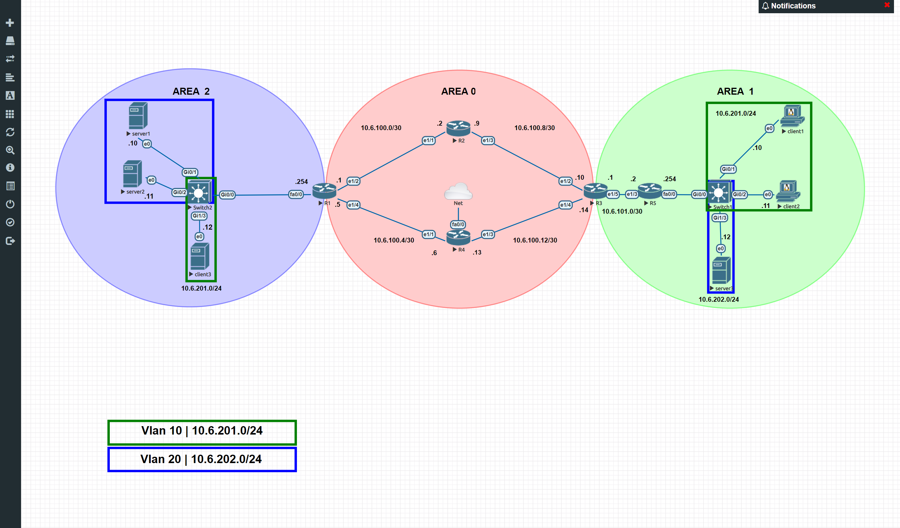

# TP6

## Tableau des Informations IP et OSPF

### Réseaux IP et aires OSPF

| Réseaux          | `area 0` | `area 1` | `area 2` | Commentaire                |
| ---------------- | -------- | -------- | -------- | -------------------------- |
| `10.6.100.0/30`  | X        | -        | -        | Liaison entre `r1` et `r2` |
| `10.6.100.4/30`  | X        | -        | -        | Liaison entre `r1` et `r4` |
| `10.6.100.8/30`  | X        | -        | -        | Liaison entre `r2` et `r3` |
| `10.6.100.12/30` | X        | -        | -        | Liaison entre `r3` et `r4` |
| `10.6.101.0/30`  | -        | X        | -        | Liaison entre `r3` et `r5` |
| `10.6.201.0/24`  | -        | X        | -        | Réseau des clients         |
| `10.6.202.0/24`  | -        | -        | X        | Réseau des serveurs        |

### Adressage IP de chacune des machines

| Machines         | `10.6.100.0/30` | `10.6.100.4/30` | `10.6.100.8/30` | `10.6.100.12/30` | `10.6.101.0/30` | `10.6.201.0/24` | `10.6.202.0/24` |
| ---------------- | --------------- | --------------- | --------------- | ---------------- | --------------- | --------------- | --------------- |
| `r1.tp6.b1`      | `10.6.100.1`    | `10.6.100.5`    | -               | -                | -               | -               | `10.6.202.254`  |
| `r2.tp6.b1`      | `10.6.100.2`    | -               | `10.6.100.9`    | -                | -               | -               | -               |
| `r3.tp6.b1`      | -               | -               | `10.6.100.10`   | `10.6.100.14`    | `10.6.101.1`    | -               | -               |
| `r4.tp6.b1`      | -               | `10.6.100.6`    | -               | `10.6.100.13`    | -               | -               | -               |
| `r5.tp6.b1`      | -               | -               | -               | -                | `10.6.101.2`    | `10.6.201.254`  | -               |
| `client1.tp6.b1` | -               | -               | -               | -                | -               | `10.6.201.10`   | -               |
| `client2.tp6.b1` | -               | -               | -               | -                | -               | `10.6.201.11`   | -               |
| `server1.tp6.b1` | -               | -               | -               | -                | -               | -               | `10.6.202.10`   |

## 2. Mise en place du lab

### Checklist IP Routeurs

Pour r1.tp6.b1, r2.tp6.b1, r3.tp6.b1, r4.tp6.b1 et r5.tp6.b1 la définition des IPs statiques et des noms de domaine se fait avec la même procédure que pour le TP précédent en utilisant les valeurs rappelées dans la section [Tableau des Informations IP et OSPF](TP_6.md#tableau-des-informations-ip-et-ospf).

### Checklist VMs

Après avoir cloné la `VM patron` 4 fois pour correspondre aux demande du cahier des charges du TP, enuite on utilise la procédure habituelle pour:

* Définir les IPs statiques
* Définir les noms de domaine
* Remplir le fichier `hosts`

avec les valeurs de la section [Tableau des Informations IP et OSPF](TP_6.md#tableau-des-informations-ip-et-ospf).

### Vérifier que tout ça fonctionne

Maintenant en faisant plusieurs `ping` on voit que le réseau est fonctionnel:

* `server1` <==> `server2` <==> `r1`
* `client1` <==> `client2` <==> `r2`
* `r2` <== `r1` ==> `r4`
* `r1` <== `r2` ==> `r3`
* `r2` <== `r3` ==> `r4`
* `r3` <== `r4` ==> `r1`

### Configuration de OSPF

*Pour cette partie on va utiliser le `r1.tp6.b1` comme exemple*

#### Activation de OSPF

Pour l'activation de OSPF une fois en mode de configuration avec une seule commande on active `OSPF` et dans le mode de configuration de cette fonction.

```cisco
r1.tp6.b1#conf t
Enter configuration commands, one per line.  End with CNTL/Z.
r1.tp6.b1(config)#router os
r1.tp6.b1(config)#router ospf 1
r1.tp6.b1(config-router)#
```

#### `router-id`

Ensuite on va configurer une `router-id` différent pour chaque routeur:

* router1 : 1.1.1.1
* router2 : 2.2.2.2
* router3 : 3.3.3.3
* router4 : 4.4.4.4
* router5 : 5.5.5.5

```cisco
r1.tp6.b1(config-router)#router-id 1.1.1.1
```

#### Configuration des routes à partager

On va indiqué aux routeurs de partager tout les réseau auxquels il sont directement connecté en précisant l'`AREA`.

* `router1.tp6.b1`
  * network 10.6.100.0 0.0.0.3 area 0
  * network 10.6.100.4 0.0.0.3 area 0
  * network 10.6.202.0 0.0.0.255 area 2
* `router2.tp6.b1`
  * network 10.6.100.0 0.0.0.3 area 0
  * network 10.6.100.8 0.0.0.3 area 0
* `router3.tp6.b1`
  * network 10.6.100.8 0.0.0.3 area 0
  * network 10.6.100.12 0.0.0.3 area 0
  * network 10.6.101.0 0.0.0.3 area 1
* `router4.tp6.b1`
  * network 10.6.100.4 0.0.0.3 area 0
  * network 10.6.100.12 0.0.0.3 area 0
* `router5.tp6.b1`
  * network 10.6.101.0 0.0.0.3 area 1
  * network 10.6.201.0 0.0.0.255 area 1

En gardant l'exemple de `r1.tp6.b1`:

```cisco
r1.tp6.b1(config-router)#network 10.6.100.0 0.0.0.3 area 0
r1.tp6.b1(config-router)#network 10.6.100.4 0.0.0.3 area 0
r1.tp6.b1(config-router)#network 10.6.202.0 0.0.0.255 area 2
```

#### Une vérification pour être sûr

On va utiliser une nouvelle fois `router1.tp6.b1`

##### On vérifie les routes enregistrées sur le routeur

```cisco
r1.tp6.b1#sh ip ro ospf
Codes: L - local, C - connected, S - static, R - RIP, M - mobile, B - BGP
       D - EIGRP, EX - EIGRP external, O - OSPF, IA - OSPF inter area
       N1 - OSPF NSSA external type 1, N2 - OSPF NSSA external type 2
       E1 - OSPF external type 1, E2 - OSPF external type 2
       i - IS-IS, su - IS-IS summary, L1 - IS-IS level-1, L2 - IS-IS level-2
       ia - IS-IS inter area, * - candidate default, U - per-user static route
       o - ODR, P - periodic downloaded static route, H - NHRP, l - LISP
       + - replicated route, % - next hop override

Gateway of last resort is not set

      10.0.0.0/8 is variably subnetted, 9 subnets, 3 masks
O        10.6.100.8/30 [110/20] via 10.6.100.2, 00:12:40, Ethernet1/2
O        10.6.100.12/30 [110/20] via 10.6.100.6, 00:09:01, Ethernet1/4
O        10.6.101.0/30 [110/30] via 10.6.100.6, 00:07:49, Ethernet1/4
                       [110/30] via 10.6.100.2, 00:07:49, Ethernet1/2
```

On peut voir avec le résultat de la commande les différentes routes `OSPF`, via quelle interface elles passent et dans le cas de `10.6.101.0/30` on voit qu'il est possible de passer par `r2.tp6.b1` ou par `r4.tp6.b1`.

##### Ensuite que le protocol OSPF est bien actif

```cisco
r1.tp6.b1#sh ip pro
*** IP Routing is NSF aware ***

Routing Protocol is "ospf 1"
  Outgoing update filter list for all interfaces is not set
  Incoming update filter list for all interfaces is not set
  Router ID 1.1.1.1
  It is an area border router
  Number of areas in this router is 2. 2 normal 0 stub 0 nssa
  Maximum path: 4
  Routing for Networks:
    10.6.100.0 0.0.0.3 area 0
    10.6.100.4 0.0.0.3 area 0
    10.6.202.0 0.0.0.255 area 2
  Routing Information Sources:
    Gateway         Distance      Last Update
    3.3.3.3              110      00:12:35
    2.2.2.2              110      00:17:27
  Distance: (default is 110)
```

Ici on voit les routes partagées et deux des routeurs OSPF du réseau.

##### Les voisins

```cisco
r1.tp6.b1#sh ip os ne  

Neighbor ID     Pri   State           Dead Time   Address         Interface
4.4.4.4           1   FULL/BDR        00:00:33    10.6.100.6      Ethernet1/4
2.2.2.2           1   FULL/BDR        00:00:36    10.6.100.2      Ethernet1/2
```

Là on a les `ID` des deux routeurs voisins, `r4.tp6.b1` et `r2.tp6.b1`.

##### Les pings

* `r1` vers `r5`

```cisco
r1.tp6.b1#ping 10.6.101.2
Type escape sequence to abort.
Sending 5, 100-byte ICMP Echos to 10.6.101.2, timeout is 2 seconds:
!!!!!
Success rate is 100 percent (5/5), round-trip min/avg/max = 36/39/40 ms
```

* `client1` vers `server1`

```bash
[root@client1 ~]# ping -c 2 server1
PING server1 (10.6.202.10) 56(84) bytes of data.
64 bytes from server1 (10.6.202.10): icmp_seq=1 ttl=60 time=61.8 ms
64 bytes from server1 (10.6.202.10): icmp_seq=2 ttl=60 time=60.6 ms

--- server1 ping statistics ---
2 packets transmitted, 2 received, 0% packet loss, time 1001ms
rtt min/avg/max/mdev = 60.607/61.238/61.870/0.678 ms
```

* On refait la même chose mais avec un `traceroute` sur `r1` (*Commande lente et non visuellement optimisée*)

```cisco
r1.tp6.b1#traceroute 10.6.101.2
Type escape sequence to abort.
Tracing the route to 10.6.101.2
VRF info: (vrf in name/id, vrf out name/id)
  1 10.6.100.2 16 msec
    10.6.100.6 16 msec
    10.6.100.2 4 msec
  2 10.6.100.14 16 msec
    10.6.100.10 16 msec
    10.6.100.14 16 msec
  3 10.6.101.2 20 msec 40 msec *
```

* On refait la même chose mais avec un `traceroute` sur `client1`

```bash
[root@client1 ~]# traceroute server1
traceroute to server1 (10.6.202.10), 30 hops max, 60 byte packets
 1  gateway (10.6.201.254)  18.575 ms  18.488 ms  31.109 ms
 2  10.6.101.1 (10.6.101.1)  43.974 ms  49.978 ms  49.938 ms
 3  10.6.100.9 (10.6.100.9)  56.803 ms  58.413 ms  77.469 ms
 4  10.6.100.1 (10.6.100.1)  85.206 ms  105.641 ms  111.506 ms
 5  server1 (10.6.202.10)  133.442 ms !X  133.822 ms !X  139.991 ms !X
```

## Lab 3 : Let's end this properly

Rappel des services pour chaque machine:

| Service         | Qui porte le service ? | Pour qui ?                     | Pourquoi ?                                                                                                                                                                                                   |
| --------------- | ---------------------- | ------------------------------ | ------------------------------------------------------------------------------------------------------------------------------------------------------------------------------------------------------------ |
| **NAT**         | `r4.tp6.b1`            | tout le monde (routeurs & VMs) | Le NAT permet d'accéder à l'extérieur, il permet de sortir du LAN. Toutes les machines peuvent en avoir besoin dans notre petite infra                                                                       |
| **Serveur Web** | `server1.tp6.b1`       | réseau client `10.6.201.0/24`  | Le serveur Web symbolise un service d'infra en interne. Dispo pour nos clients. Plus de détails dans la section dédiée.                                                                                      |
| **DHCP**        | `client2.tp6.b1`       | réseau client `10.6.201.0/24`  | Le DHCP (qui permet d'attribuer des IPs automatiquement) c'est pour des clients. Pas pour des serveurs. Un serveur, on veut qu'il ait une IP fixe.                                                           |
| **DNS**         | `server1.tp6.b1`       | tout le monde (routeurs & VMs) | Le DNS nous permettra de résoudre les noms de domaines en local et nous passer du fichier `/etc/hosts`                                                                                                       |
| **NTP**         | `server1.tp6.b1`       | réseau serveur `10.6.202.0/24` | Le NTP, qui permet la synchronisation de l'heure, est souvent indispensable pourdes serveurs mais totalement négligeable pour des clients (genre vos PCs, s'ils sont pas à l'heure, tout le monde s'en fout) |

### 1. NAT : accès internet

Sur [`EVE-NG`](#informations) pour l'accès au réseau extérieur le plus simple est d'ajouter une deuxième carte réseau sans passerelle directement connecté à un réseau par exemple le même que la carte principale. Ceci va donner accès au réseau de cette carte en utilisant le `cloud` (en forme de nuage) et en le connectant à la machine à laquelle on veut fournir une connexion.\
*Par défaut eve-ng ne gère pas le `NAT` pour utiliser cette fonction il faut ajouter une carte réseau virtuelle supplémentaire et configurer le routage manuellement, étant sur un réseau local dont je connais l'implentation exacte.*

Après avoir relié `r4.tp6.b1` avec le `Cloud`, on regarde quelle interface est est quelle interface est utilisée pour la connexion, ici il s'agit comme sur le sujet de l'interface `fastEthernet 0/0`.

#### 1.1 Configuration IP

```cisco
r4.tp6.b1(config)#int fa0/0
r4.tp6.b1(config-if)#ip add dhcp
r4.tp6.b1(config-if)#no shut
```

On fait une vérification:

```cisco
r4.tp6.b1(config)#int fa0/0
r4.tp6.b1(config-if)#ip add dhcp
r4.tp6.b1(config-if)#no shut
```

```cisco
r4.tp6.b1#sh ip int br
Interface                  IP-Address      OK? Method Status                Protocol
FastEthernet0/0            192.168.20.26   YES DHCP   up                    up
```

#### 1.2 Configuration du NAT

On fait comme pour le TP précédent,

```cisco
r4.tp6.b1(config)#int fa0/0
r4.tp6.b1(config-if)#ip nat out | (ip nat outside)
r4.tp6.b1(config-if)#
*Feb 28 17:22:34.555: %LINEPROTO-5-UPDOWN: Line protocol on Interface NVI0, changed state to up
```

Pour la carte qui va partager l'accès au réseau WAN (Internet).

```cisco
r4.tp6.b1(config)#int e1/1
r4.tp6.b1(config-if)#ip na in
r4.tp6.b1(config-if)#int e1/3
r4.tp6.b1(config-if)#ip na in | (ip nat inside)
```

Pour les cartes qui sont dans les réseau LANs qui peuvent également être des réseau WANs en fonction de la topologie de l'infrastructure.

```cisco
r4.tp6.b1(config)#ip nat in so li 1 int fa0/0 ov | (ip nat inside source list 1 interface fastEthernet 0/0 overload)
r4.tp6.b1(config)#ac 1 p an | (access-list 1 permit any)
```

Autorise les réseau `"nat inside"` à accéder à Internet.

```cisco
r4.tp6.b1(config)#router os 1
r4.tp6.b1(config-router)#default-inf ori
```

Indique au réseau `OSPF` que `r4.tp6.b1` partage la connexion vers l'extérieur.

#### 1.3 Configuration DNS

Avant de faire les tests on va configurer l'adresse IP du serveur `DNS` sur les routeurs pour pouvoir résoudre les noms de domaines.

```cisco
r1.tp6.b1(config)# ip domain-lookup
r1.tp6.b1(config)# ip name-server 192.168.10.6
```

Pour les tests il faut aussi avoir indiqué un serveur `DNS` aux VMs, `client1.tp6.b1` le serveur DHCP le fera automatiquement dans la suite du TP.

```bash
[root@client2 ~]# nano /etc/resolv.conf

nameserver 192.168.10.6
```

#### 1.4 Vérifications

On commence par vérifier que la route par défaut est bien renseignée sur tous les routeurs,\
Un exemple pour `r2.tp6.b1`

```cisco
r2.tp6.b1#sh ip route
Codes: L - local, C - connected, S - static, R - RIP, M - mobile, B - BGP
       D - EIGRP, EX - EIGRP external, O - OSPF, IA - OSPF inter area
       N1 - OSPF NSSA external type 1, N2 - OSPF NSSA external type 2
       E1 - OSPF external type 1, E2 - OSPF external type 2
       i - IS-IS, su - IS-IS summary, L1 - IS-IS level-1, L2 - IS-IS level-2
       ia - IS-IS inter area, * - candidate default, U - per-user static route
       o - ODR, P - periodic downloaded static route, H - NHRP, l - LISP
       + - replicated route, % - next hop override

Gateway of last resort is 10.6.100.10 to network 0.0.0.0

O*E2  0.0.0.0/0 [110/1] via 10.6.100.10, 21:25:34, Ethernet1/3
                [110/1] via 10.6.100.1, 21:25:34, Ethernet1/1
      10.0.0.0/8 is variably subnetted, 9 subnets, 3 masks
C        10.6.100.0/30 is directly connected, Ethernet1/1
L        10.6.100.2/32 is directly connected, Ethernet1/1
O        10.6.100.4/30 [110/20] via 10.6.100.1, 1d15h, Ethernet1/1
C        10.6.100.8/30 is directly connected, Ethernet1/3
L        10.6.100.9/32 is directly connected, Ethernet1/3
O        10.6.100.12/30 [110/20] via 10.6.100.10, 1d15h, Ethernet1/3
O IA     10.6.101.0/30 [110/20] via 10.6.100.10, 1d14h, Ethernet1/3
O IA     10.6.201.0/24 [110/21] via 10.6.100.10, 1d14h, Ethernet1/3
O IA     10.6.202.0/24 [110/11] via 10.6.100.1, 1d15h, Ethernet1/1
```

La ligne `Gateway of last resort is 10.6.100.10 to network 0.0.0.0` indique que si le routeur ne trouve pas de route pour aller au réseau demandé il utilisera cette route là pour trouver la bonne destination.

#### 1.5 Tests

Pour faire un test depuis une des VMs on peut utiliser la commande `curl`\
Un exemple avec `server2.tp6.b1`

```bash
[root@server2 ~]# curl antoinethys.com > curl
```

[Fichier `curl`](TP6/curl.md) avec formatage Markdown
Cette commande renvoit le code `HTML` du site web hébergé au domaine `antoinethys.com`.

On peut aussi faire un test depuis l'un des routeurs, `r4.tp6.b1` par exemple,\
Il est possible d'utiliser la commande `telnet` en passant une adresse IP/nom de domaine et un port comme argument, une fois la connexion établie on peut rentrer des commandes, s'il s'agit d'un serveur web non sécurisé avec la commande `GET /` on obtient le code html de la page d'index.

```bash
r2.tp6.b1#telnet 192.168.10.5 80
```

Le résultat de la [commande](TP6/telnet.md)

### 2. Un service d'infra

Le `server1.tp6.b1` a accès à `Internet` ce que va permettre d'installer un serveur web, ici nginx.

```bash
[root@server1 ~]# ping -c 2 antoinethys.com
PING antoinethys.com (151.80.143.153) 56(84) bytes of data.
64 bytes from ameliehusson.com (151.80.143.153): icmp_seq=1 ttl=54 time=38.5 ms
64 bytes from ameliehusson.com (151.80.143.153): icmp_seq=2 ttl=54 time=89.7 ms

--- antoinethys.com ping statistics ---
2 packets transmitted, 2 received, 0% packet loss, time 1001ms
rtt min/avg/max/mdev = 38.595/64.148/89.702/25.554 ms
```

#### 2.1 Firewall

##### 2.1.1 Démarrage du service

```bash
[root@server1 ~]# systemctl status -l firewalld
● firewalld.service - firewalld - dynamic firewall daemon
   Loaded: loaded (/usr/lib/systemd/system/firewalld.service; enabled; vendor preset: enabled)
   Active: active (running) since ven. 2019-03-01 18:19:32 CET; 7h ago
     Docs: man:firewalld(1)
 Main PID: 2608 (firewalld)
   CGroup: /system.slice/firewalld.service
           └─2608 /usr/bin/python -Es /usr/sbin/firewalld --nofork --nopid

mars 01 18:19:27 server1.tp6.b1 systemd[1]: Starting firewalld - dynamic firewall daemon...
mars 01 18:19:32 server1.tp6.b1 systemd[1]: Started firewalld - dynamic firewall daemon.
```

Le service du pare-feu est déjà démarré automatiquement au démarrage.

##### 2.1.2 Ouverture des ports

Afin de permettre l'accès au serveur web qui sera bientôt installé sur cette machine il est nécessaire d'ouvrir le port correspondant de façon permanente, ici le port 80.

```bash
[root@server1 ~]# firewall-cmd --add-port=80/tcp --permanent
success
[root@server1 ~]# firewall-cmd --reload
success
```

#### 2.2 Serveur Web

##### 2.2.1 Installation

On commence par ajouter le dépôt `epel` puis on install `nginx`.

```bash
[root@server1 ~]# yum install -y epel-release
[root@server1 ~]# yum install -y nginx
```

Il est possible de changer la page d'acceuil en modifiant le fichier `/usr/share/nginx/html/index.html`.

##### 2.2.2 Démarrage

On commence par activer le démarrage automatique du service `nginx` puis on le lance.

```bash
[root@server1 ~]# systemctl enable nginx
[root@server1 ~]# systemctl start nginx
```

#### 2.3 Tests

##### 2.3.1 Le service

On vérifie que le service est bien actif,

```bash
[root@server1 ~]# systemctl status nginx -l
● nginx.service - The nginx HTTP and reverse proxy server
   Loaded: loaded (/usr/lib/systemd/system/nginx.service; enabled; vendor preset: disabled)
   Active: active (running) since sam. 2019-03-02 02:28:07 CET; 2min 27s ago
  Process: 3959 ExecStart=/usr/sbin/nginx (code=exited, status=0/SUCCESS)
  Process: 3957 ExecStartPre=/usr/sbin/nginx -t (code=exited, status=0/SUCCESS)
  Process: 3956 ExecStartPre=/usr/bin/rm -f /run/nginx.pid (code=exited, status=0/SUCCESS)
 Main PID: 3961 (nginx)
   CGroup: /system.slice/nginx.service
           ├─3961 nginx: master process /usr/sbin/ngin
           └─3962 nginx: worker proces

mars 02 02:28:07 server1.tp6.b1 systemd[1]: Starting The nginx HTTP and reverse proxy server...
mars 02 02:28:07 server1.tp6.b1 nginx[3957]: nginx: the configuration file /etc/nginx/nginx.conf syntax is ok
mars 02 02:28:07 server1.tp6.b1 nginx[3957]: nginx: configuration file /etc/nginx/nginx.conf test is successful
mars 02 02:28:07 server1.tp6.b1 systemd[1]: Failed to read PID from file /run/nginx.pid: Invalid argument
mars 02 02:28:07 server1.tp6.b1 systemd[1]: Started The nginx HTTP and reverse proxy server.
```

##### 2.3.2 En local

On fait un test avec `curl`,

```bash
[root@server1 ~]# curl localhost > curl_local
```

Ce qui donne ce [résultat](TP6/curl_local.md).

##### 2.3.3 Depuis `client1.tp6.b1`

Le fichier `host` ayant déjà était complété, il ne reste plus qu'à faire un test depuis `client1.tp6.b1` vers `server1.tp6.b1`.

```bash
[root@client1 ~]# curl server1.tp6.b1 > curl_nginx
```

Voilà ce que donne le [résultat](TP6/curl_nginx.md) de la commande.

### 3. Serveur DHCP

#### 3.1 Préparation de la machine

##### 3.1.1 On renomme `client2.tp6.b1` en `dhcp.tp6.b1`

```bash
[root@client2 ~]# hostname dhcp.tp6.b1
[root@client2 ~]# echo 'dhcp.tp6.b1' | sudo tee /etc/hostname
dhcp.tp6.b1
```

##### 3.1.2 Modification de la configuration du serveur `DHCP`

Il faut changer les adresses et plages IPs ainsi que d'ajouter le serveur DNS dans le [fichier de configuration](TP6/dhcpd.conf).

##### 3.1.3 Installation du serveur `DHCP`

```bash
[root@client2 ~]# yum install -y dhcp
```

Ensuite on remplace le contenu du fichier `/etc/dhcp/dhcpd.conf` par celui de la partie [3.1.2](TP_6.md#312-modification-de-la-configuration-du-serveur-dhcp).

```bash
[root@client2 ~]# systemctl enable dhcpd && systemctl start dhcpd
```

Le serveur `DHCP` est bien démarré et en démarrage automatique,

```bash
[root@client2 ~]# systemctl status dhcpd
● dhcpd.service - DHCPv4 Server Daemon
   Loaded: loaded (/usr/lib/systemd/system/dhcpd.service; enabled; vendor preset: disabled)
   Active: active (running) since sam. 2019-03-02 19:16:27 CET; 46s ago
     Docs: man:dhcpd(8)
           man:dhcpd.conf(5)
 Main PID: 4108 (dhcpd)
   Status: "Dispatching packets..."
   CGroup: /system.slice/dhcpd.service
           └─4108 /usr/sbin/dhcpd -f -cf /etc/dhcp/dhcpd.conf -user dhcpd -gr...

mars 02 19:16:27 dhcp.tp6.b1 systemd[1]: Started DHCPv4 Server Daemon.
mars 02 19:16:27 dhcp.tp6.b1 dhcpd[4108]: No subnet declaration for eth1 (no....
mars 02 19:16:27 dhcp.tp6.b1 dhcpd[4108]: ** Ignoring requests on eth1.  If ...t
mars 02 19:16:27 dhcp.tp6.b1 dhcpd[4108]:    you want, please write a subnet...n
mars 02 19:16:27 dhcp.tp6.b1 dhcpd[4108]:    in your dhcpd.conf file for the...t
mars 02 19:16:27 dhcp.tp6.b1 dhcpd[4108]:    to which interface eth1 is atta...*
mars 02 19:16:27 dhcp.tp6.b1 dhcpd[4108]: nt
mars 02 19:16:27 dhcp.tp6.b1 dhcpd[4108]: Listening on LPF/eth0/00:50:00:00:...4
mars 02 19:16:27 dhcp.tp6.b1 dhcpd[4108]: Sending on   LPF/eth0/00:50:00:00:...4
mars 02 19:16:27 dhcp.tp6.b1 dhcpd[4108]: Sending on   Socket/fallback/fallb...t
Hint: Some lines were ellipsized, use -l to show in full.
```

#### 3.2 `client1.tp6.b1`

##### 3.2.1 Configuration de la carte réseau

```bash
[root@client1 ~]# nano /etc/sysconfig/network-scripts/ifcfg-eth0


NAME=eth0
DEVICE=eth0

BOOTPROTO=dhcp
ONBOOT=yes


[root@client1 ~]# ifdown eth0 && ifup eth0
```

##### 3.2.2 Test

On va forcer le système à demander une adresse IP au serveur DHCP,

```bash
[root@client1 ~]# dhclient -v
Internet Systems Consortium DHCP Client 4.2.5
Copyright 2004-2013 Internet Systems Consortium.
All rights reserved.
For info, please visit https://www.isc.org/software/dhcp/

Listening on LPF/eth1/00:50:00:00:09:01
Sending on   LPF/eth1/00:50:00:00:09:01
Listening on LPF/eth0/00:50:00:00:09:00
Sending on   LPF/eth0/00:50:00:00:09:00
Sending on   Socket/fallback
DHCPDISCOVER on eth1 to 255.255.255.255 port 67 interval 8 (xid=0x8b282dc)
DHCPDISCOVER on eth0 to 255.255.255.255 port 67 interval 4 (xid=0x717860d8)
DHCPREQUEST on eth0 to 255.255.255.255 port 67 (xid=0x717860d8)
DHCPOFFER from 10.6.201.11
DHCPACK from 10.6.201.11 (xid=0x717860d8)
bound to 10.6.201.51 -- renewal in 250 seconds.
```

L'adresse IP attribuée à la machine `client1.tp6.b1` est donc `10.6.201.51`.

### 4. Serveur DNS

#### 4.1 Mise en place du serveur DNS

Tout ceci doit être fait sur `server1.tp6.b1`, c'est cette machine qui hébergera le serveur DNS.

##### 4.1.1 Installation du service

```bash
[root@client1 ~]# yum install -y bind*
```

#### 4.2 Configuration

##### 4.2.2 Fichiers de configuration

Les fichiers présents dans le dossier [dns](TP6/dns/) contiennent toute la configuration nécéssaire, la zone de recherche direct ainsi que la zone de recherche inversée, on doit juste y rajouter les lignes pour `server2.tp6.b1`.\

* Change le contenu du fichier `/etc/named.conf` par celui contenu [ici](TP6/dns/named.conf).
* Ensuite on ajoute les fichiers [forward.tp6.b1](TP6/dns/forward.tp6.b1) et [reverse.tp6.b1](TP6/dns/reverse.tp6.b1) dans le répertoire `/var/named/`.
* Puis on change le propriétaire des fichiers:\
  *(`named` étant le nom du service dns)*

```bash
chown named:named /var/named/*tp6.b1
```

##### 4.2.3 Ouverture des ports du pare-feu

```bash
[root@server1 ~]# firewall-cmd --add-port=53/tcp --permanent
success
[root@server1 ~]# firewall-cmd --add-port=53/udp --permanent
success
[root@server1 ~]# firewall-cmd --reload
success
```

##### 4.2.3 Démarrage du service

On active le démarrage automatique et on le lance.

```bash
[root@server1 ~]# systemctl enable named && systemctl start named
```

##### 4.2.4 Clients

* Pour donner l'adresse IP du serveur DNS au `client2.tp6.b1` il faut modifier `option domain-name-servers 192.168.10.6;` en `option domain-name-servers 10.6.202.10;`.\
* Il faut aussi changer l'adresse du serveur DNS dans le fichier `/etc/resolv.conf` pour toutes les autres machines.
* Ensuite on vide le fichiers `/etc/hosts` sur chaque machine pour tester le fonctionnement du serveur DNS.

##### 4.2.5 Routeurs

Sur tout les routeurs il faut indiquer à nouveau le serveur DNS mais cette fois en précisant qu'il s'agit de `server1.tp6.b1`.

```cisco
r1.tp6.b1(config)# no ip name-server 192.168.10.6
r1.tp6.b1(config)# ip name-server 10.6.202.10
```

#### 4.3 Test

##### 4.3.1 Depuis `client2.tp6.b1`

`client1.tp6.b1` utilise `server1.tp6.b1` comme DNS indiqué par le serveur DHCP.

```bash
[root@client1 ~]# dig server2.tp6.b1

; <<>> DiG 9.9.4-RedHat-9.9.4-73.el7_6 <<>> server2.tp6.b1
;; global options: +cmd
;; Got answer:
;; ->>HEADER<<- opcode: QUERY, status: NOERROR, id: 52117
;; flags: qr aa rd; QUERY: 1, ANSWER: 1, AUTHORITY: 1, ADDITIONAL: 2
;; WARNING: recursion requested but not available

;; OPT PSEUDOSECTION:
; EDNS: version: 0, flags:; udp: 4096
;; QUESTION SECTION:
;server2.tp6.b1.                        IN       A

;; ANSWER SECTION:
server2.tp6.b1.   604800        IN      A        10.6.202.11

;; AUTHORITY SECTION:
tp6.b1.           604800        IN      NS       server1.tp6.b1.

;; ADDITIONAL SECTION:
server1.tp6.b1.   604800        IN      A        10.6.202.10

;; Query time: 138 msec
;; SERVER: 10.6.202.10#53(10.6.202.10)
;; WHEN: dim. mars 03 01:49:41 CET 2019
;; MSG SIZE  rcvd: 97
```

En direct

```bash
[root@client1 ~]# dig -x 10.6.201.11

; <<>> DiG 9.9.4-RedHat-9.9.4-73.el7_6 <<>> -x 10.6.201.11
;; global options: +cmd
;; Got answer:
;; ->>HEADER<<- opcode: QUERY, status: NOERROR, id: 41983
;; flags: qr aa rd; QUERY: 1, ANSWER: 1, AUTHORITY: 1, ADDITIONAL: 2
;; WARNING: recursion requested but not available

;; OPT PSEUDOSECTION:
; EDNS: version: 0, flags:; udp: 4096
;; QUESTION SECTION:
;11.201.6.10.in-addr.arpa.      IN      PTR

;; ANSWER SECTION:
11.201.6.10.in-addr.arpa. 86400 IN      PTR     client2.tp6.b1.

;; AUTHORITY SECTION:
6.10.in-addr.arpa.        86400 IN      NS      server1.tp6.b1.

;; ADDITIONAL SECTION:
server1.tp6.b1.          604800 IN      A       10.6.202.10

;; Query time: 160 msec
;; SERVER: 10.6.202.10#53(10.6.202.10)
;; WHEN: dim. mars 03 02:20:28 CET 2019
;; MSG SIZE  rcvd: 119
```

En inversé

##### 4.3.2 Depuis `r2.tp6.b1`

```cisco
r2.tp6.b1#ping client2.tp6.b1
Translating "client2.tp6.b1"...domain server (10.6.202.10) [OK]

Type escape sequence to abort.
Sending 5, 100-byte ICMP Echos to 10.6.201.11, timeout is 2 seconds:
!!!!!
Success rate is 100 percent (5/5), round-trip min/avg/max = 24/36/52 ms
```

### 5. NTP

#### 5.1 Serveur NTP

##### 5.1.1 Configuration

Sur le fichier du sujet on doit juste ajouter les serveurs NTP par exemple :

* 0.pool.ntp.org
* 1.pool.ntp.org
* 2.pool.ntp.org
* 3.pool.ntp.org

Le fichier complétés est [ici](TP6/chrony/serveur/chrony.conf).\
On y place le contenu dans le fichier `/etc/chrony.conf`.

##### 5.1.2 Ouverture des ports

```bash
[root@server1 ~]# firewall-cmd --add-port=123/udp --permanent
success
[root@server1 ~]# firewall-cmd --reload
success
```

##### 5.1.3 Démarrage du service

```bash
[root@server1 ~]# systemctl start chronyd && systemctl status chronyd -l
● chronyd.service - NTP client/server
   Loaded: loaded (/usr/lib/systemd/system/chronyd.service; enabled; vendor preset: enabled)
   Active: active (running) since sam. 2019-03-02 23:37:48 CET; 22h ago
     Docs: man:chronyd(8)
           man:chrony.conf(5)
  Process: 2628 ExecStartPost=/usr/libexec/chrony-helper update-daemon (code=exited, status=0/SUCCESS)
  Process: 2579 ExecStart=/usr/sbin/chronyd $OPTIONS (code=exited, status=0/SUCCESS)
 Main PID: 2591 (chronyd)
   CGroup: /system.slice/chronyd.service
           └─2591 /usr/sbin/chronyd

mars 02 23:45:39 server1.tp6.b1 chronyd[2591]: System clock was stepped by 1.267332 seconds
mars 02 23:45:41 server1.tp6.b1 chronyd[2591]: Selected source 193.200.43.105
mars 02 23:45:42 server1.tp6.b1 chronyd[2591]: Source 37.187.104.44 replaced with 91.121.96.146
mars 02 23:45:48 server1.tp6.b1 chronyd[2591]: Selected source 95.81.173.155
mars 02 23:46:45 server1.tp6.b1 chronyd[2591]: Selected source 94.23.37.34
mars 02 23:54:19 server1.tp6.b1 chronyd[2591]: Selected source 95.81.173.155
mars 03 04:21:40 server1.tp6.b1 chronyd[2591]: Selected source 91.121.96.146
mars 03 10:41:30 server1.tp6.b1 chronyd[2591]: Selected source 94.23.37.34
mars 03 17:18:16 server1.tp6.b1 chronyd[2591]: Selected source 91.121.96.146
mars 03 21:06:13 server1.tp6.b1 chronyd[2591]: Selected source 94.23.37.34
```

##### 5.1.4 Vérifier l'état de la synchronisation NTP

```bash
[root@server1 ~]# chronyc sources && echo && echo && chronyc tracking
210 Number of sources = 4
MS Name/IP address         Stratum Poll Reach LastRx Last sample
===============================================================================
^+ 193.200.43.105                2  10   377  1006   -608us[ -270us] +/-   47ms
^* ks312903.kimsufi.com          3  10   377    10  -1331us[ -983us] +/-   51ms
^+ milkyway.jeroendeneef.com     2  10   377   789  +2887us[+3228us] +/-   47ms
^+ ntp-3.arkena.net              2  10   377    28  -1385us[-1038us] +/-   41ms


Reference ID    : 5E172522 (ks312903.kimsufi.com)
Stratum         : 4
Ref time (UTC)  : Sun Mar 03 21:28:07 2019
System time     : 0.000774044 seconds fast of NTP time
Last offset     : +0.000347646 seconds
RMS offset      : 0.000478879 seconds
Frequency       : 0.048 ppm fast
Residual freq   : +0.002 ppm
Skew            : 0.063 ppm
Root delay      : 0.038264576 seconds
Root dispersion : 0.012483912 seconds
Update interval : 1035.9 seconds
Leap status     : Normal
```

#### 5.2 Client NTP

On doit reproduire ces étapes sur toutes les machines.

##### 5.2.1 Configuration

Le [fichier de configuration](TP6/chrony/client/chrony.conf) fournis contient la configuration nécéssaire, il indique comme serveur source de temps `server1.tp6.b1`\
Maintenant il faut remplacer le fichier `/etc/chrony.conf` par [celui ci](TP6/chrony/client/chrony.conf).

##### 5.2.2 Ouverture des ports

```bash
[root@server1 ~]# firewall-cmd --add-port=123/udp --permanent
success
[root@server1 ~]# firewall-cmd --reload
success
```

##### 5.2.3 Démmarrage du service

```bash
[root@server2 ~]# systemctl start chronyd && systemctl status chronyd -l
● chronyd.service - NTP client/server
   Loaded: loaded (/usr/lib/systemd/system/chronyd.service; enabled; vendor preset: enabled)
   Active: active (running) since dim. 2019-03-03 00:08:17 CET; 22h ago
     Docs: man:chronyd(8)
           man:chrony.conf(5)
  Process: 2626 ExecStartPost=/usr/libexec/chrony-helper update-daemon (code=exited, status=0/SUCCESS)
  Process: 2580 ExecStart=/usr/sbin/chronyd $OPTIONS (code=exited, status=0/SUCCESS)
 Main PID: 2602 (chronyd)
   CGroup: /system.slice/chronyd.service
           └─2602 /usr/sbin/chronyd

mars 03 00:08:16 server2.tp6.b1 systemd[1]: Starting NTP client/server...
mars 03 00:08:16 server2.tp6.b1 chronyd[2602]: chronyd version 3.2 starting (+CMDMON +NTP +REFCLOCK +RTC +PRIVDROP +SCFILTER +SECHASH +SIGND +ASYNCDNS +IPV6 +DEBUG)
mars 03 00:08:17 server2.tp6.b1 chronyd[2602]: Frequency 0.796 +/- 7.643 ppm read from /var/lib/chrony/drift
mars 03 00:08:17 server2.tp6.b1 systemd[1]: Started NTP client/server.
mars 03 00:08:32 server2.tp6.b1 chronyd[2602]: Selected source 51.255.141.154
mars 03 00:09:38 server2.tp6.b1 chronyd[2602]: Selected source 51.255.197.148
```

##### 5.2.4 Vérifier l'état de la synchronisation NTP

```bash
[root@server2 ~]# chronyc sources && echo && chronyc tracking
210 Number of sources = 1
MS Name/IP address         Stratum Poll Reach LastRx Last sample
===============================================================================
^? server1                       0   6     0     -     +0ns[   +0ns] +/-    0ns

Reference ID    : 7F7F0101 ()
Stratum         : 10
Ref time (UTC)  : Sun Mar 03 22:12:19 2019
System time     : 0.000000002 seconds slow of NTP time
Last offset     : +0.000000000 seconds
RMS offset      : 0.000000000 seconds
Frequency       : 0.002 ppm slow
Residual freq   : +0.000 ppm
Skew            : 0.000 ppm
Root delay      : 0.000000000 seconds
Root dispersion : 0.000000000 seconds
Update interval : 0.0 seconds
Leap status     : Normal
```

## Aller plus loin

### 1. Vlans

#### 1.1 "Matériel"

Pour la suite du TP il est nécéssaire d'avoir des switchs cisco. Ici ce sont des switchs vIOS L2 cisco version 15.2.4.55e qui tournent sous qemu 2.4.0.

#### 1.2 Topology



* Vlan 201
  * Nom: client-network
  * Switch1:
    * Port Gi0/1-3
  * Switch2:
    * Port Gi0/1-3
* Vlan 202
  * Nom: server
  * Switch1:
    * Port Gi1/1-3
  * Switch2:
    * Port Gi1/1-3
* Trunk
  * Switch1:
    * Port Gi0/0
  * Switch2:
    * Port Gi1/0

#### 1.3 Manipulation sur les Switchs

La configuration des Vlans est simple à petite échelle mais pour de plus grosse infrastructures celà devient vite assez long, la solition est d'utiliser `VTP` (VLAN Trunking Protocol) que j'ai moi même déjà dû utiliser sur d'autre types d'infrastructures dans le cadre de mes études. Ce TP sera fait en utilisant `VTP`

##### 1.3.1 Switch 2

Par défaut tous les ports du switch sont sur le `Vlan 1`

```cisco
switch2#sh vl br

VLAN Name                             Status    Ports
---- -------------------------------- --------- -------------------------------
1    default                          active    Gi0/0, Gi0/1, Gi0/2, Gi0/3
                                                Gi1/0, Gi1/1, Gi1/2, Gi1/3
1002 fddi-default                     act/unsup
1003 token-ring-default               act/unsup
1004 fddinet-default                  act/unsup
1005 trnet-default                    act/unsup
```

Maintennant avant de faire la configuration des Vlan on va commencer par la `VTP`

```cisco
switch2(config)#vtp domain tp6
Changing VTP domain name from NULL to tp6
*Mar 13 21:05:23.938: %SW_VLAN-6-VTP_DOMAIN_NAME_CHG: VTP domain name changed to tp6.
switch2(config)#vtp version 3
*Mar 13 21:06:23.082: %SW_VLAN-6-OLD_CONFIG_FILE_READ: Old version 2 VLAN configuration file detected and read OK.  Version 3
    files will be written in the future.
switch2(config)#vtp mode server vlan
switch2(config)#vtp mode server mst
Device mode already VTP Server for VLANS.
switch2(config)#vtp pruning
Pruning switched on
switch2(config)#vtp password xxxxxxxx
switch2(config)#
switch2#
*Mar 14 14:54:58.599: %SYS-5-CONFIG_I: Configured from console by console
switch2#vtp primary force
This system is becoming primary server for feature vlan
switch2#
*Mar 14 14:56:10.277: %SW_VLAN-4-VTP_PRIMARY_SERVER_CHG: 5000.0001.0000 has become the primary server for the VLAN VTP feature
```

"vtp prunning" permet la libération de la bande passante en évitant que les trams réseau aillent vers des switch qui n'utilise pas ce certains vlans, ce n'est pas obligatoire as reste une bonne pratique si l'infrastruction le supporte.\
*Même s'il s'agit uniquement d'un lab un mot de passe sécurisé est utilisé pour la configuration et n'est donc pas indiqué dans ce fichier de rendu*\
*La version 3 de vtp n'est pas nécessaire pour ce type d'infrastructure, la version 1 serait plus adaptée mais cela permet plus de marge pour la réutilisation de ce lab.*

```cisco
switch2#sh vtp status 
VTP Version capable             : 1 to 3
VTP version running             : 3
VTP Domain Name                 : tp6
VTP Pruning Mode                : Enabled
VTP Traps Generation            : Disabled
Device ID                       : 5000.0001.0000

Feature VLAN:
--------------
VTP Operating Mode                : Primary Server
Number of existing VLANs          : 7
Number of existing extended VLANs : 0
Maximum VLANs supported locally   : 4096
Configuration Revision            : 4
Primary ID                        : 5000.0001.0000
Primary Description               : switch2
MD5 digest                        : 0xCE 0x50 0xA4 0x75 0x15 0xFB 0xAE 0x17
                                    0x24 0x56 0xC0 0x9A 0x7D 0x76 0x47 0x90


Feature MST:
--------------
VTP Operating Mode                : Server
Configuration Revision            : 0
Primary ID                        : 0000.0000.0000
Primary Description               :
MD5 digest                        :


Feature UNKNOWN:
--------------
VTP Operating Mode                : Transparent

```

Maintenant il est possible de passer à la configuration des deux Vlans.

```cisco
switch2(config)#vlan 201
switch2(config-vlan)#name clients
switch2(config-vlan)#exit
switch2(config)#vlan 202
switch2(config-vlan)#name servers
switch2(config-vlan)#exit
```

Ensuite on passe aux interfaces.

```cisco
switch2(config)#int range Gi0/1-3
switch2(config-if-range)#switchport mode access
switch2(config-if-range)#switchport access vlan 201
switch2(config-if-range)#int range Gi1/1-3
switch2(config-if-range)#switchport mode access
switch2(config-if-range)#switchport access vlan 202
switch2(config-if-range)#exit
switch2(config)#int G1/0
switch2(config-if)#switchport trunk encapsulation dot1q
switch2(config-if)#switchport mode trunk
```

**La configuration obtenue:**

```cisco
switch2#sh vlan br

VLAN Name                             Status    Ports
---- -------------------------------- --------- -------------------------------
1    default                          active    Gi0/0
201  clients                          active    Gi0/1, Gi0/2, Gi0/3
202  servers                          active    Gi1/1, Gi1/2, Gi1/3
1002 fddi-default                     act/unsup
1003 trcrf-default                    act/unsup
1004 fddinet-default                  act/unsup
1005 trbrf-default                    act/unsup
switch2#
switch2#sh int trunk

Port        Mode             Encapsulation  Status        Native vlan
Gi1/0       on               802.1q         trunking      1

Port        Vlans allowed on trunk
Gi1/0       1-4094

Port        Vlans allowed and active in management domain
Gi1/0       1,201-202

Port        Vlans in spanning tree forwarding state and not pruned
Gi1/0       1,201-202
```

##### 1.3.2 Switch 1

On configure le switch comme client vtp.

```cisco
switch1(config)#vtp m tr
Setting device to VTP Transparent mode for VLANS.
switch1(config)#vtp m cl
Setting device to VTP Client mode for VLANS.
switch1(config)#vtp version 3
Cannot set the version to 3 because domain name is not configured
switch1(config)#vtp dom
switch1(config)#vtp domain tp6
Changing VTP domain name from NULL to tp6
switch1(config)#
*Mar 14 20:18:25.996: %SW_VLAN-6-VTP_DOMAIN_NAME_CHG: VTP domain name changed to tp6.
switch1(config)#vtp password xxxxxxxxx
Setting device VTP password to xxxxxxxxx
switch1(config)#vtp vers
switch1(config)#vtp version 3
switch1(config)#
*Mar 14 20:18:46.914: %SW_VLAN-6-OLD_CONFIG_FILE_READ: Old version 2 VLAN configuration file detected and read OK.  Version 3
    files will be written in the future.
switch1(config)# vtp pruning
Pruning switched on
switch1(config)#
switch1(config)#int G0/0
switch1(config-if)#switchport trunk encapsulation dot1q
switch1(config-if)#switchport mode trunk
```

#### 1.4 Routeurs

##### 1.4.1 Description

Maintenant il faut configurer les routeurs, pour le celà il faut faire du "Router-on-a-stick".\
Il faut ajouter de nouvelles adresses IPs sur les routeurs correspondant au réseau des Vlans auxquels ils sont reliés. 

##### 1.4.2 Nouvelle table IP

| Routeur      |  `Vlan 201`  |  `Vlan 202`  |
|--------------|--------------|--------------|
| `r1.tp6.b1`  | 10.6.201.253 | 10.6.202.254 |
| `r5.tp6.b1`  | 10.6.201.254 | 10.6.202.253 |

## __Informations__

* Ce TP a entièrement été réalisé sur [EVE-NG Community](https://www.eve-ng.net/) et la connexion `telnet` pour l'accès console aux routeurs et aux machines sont faites avec `"EVE-NG Intergration (Linux client side)"` utilisant le protocol `telnet` mais permetant aussi les protocols `vnc` et `rdp`.
* La virtualisation des trois VMs Centos a été faite avec `QEMU` intégré à `EVE-NG`, (par défaut la version 2.4.0).
* EVE-NG a été installé via son image iso sur une machine virtuelle hébergée `Proxmox`.
* Le routeur servant pour le réseau NAT et un pfsense hébergé également sur le `Proxmox`.
* Le serveur DNS est sur un réseau différent que celui attribué par le serveur DHCP mais le routage est bien éffectué entre les deux réseau via un tunnel IPsec.
* Topology du réseau sur EVE-NG [ici](TP6/topology_eve.png).