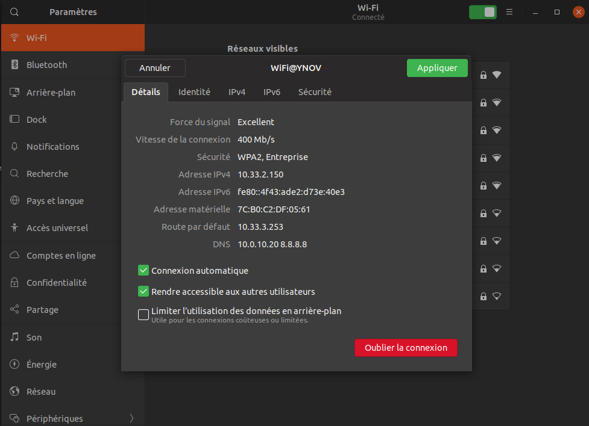

# TP 2

# I.

# 1

    En ligne de commande :

    Carte Wifi :
        Nom : wlp2s0
        Adresse MAC : 7c:b0:c2:df:05:61
        Adresse IP : 10.33.2.150
        Adresse Réseau : 10.33.0.0
        Adresse de broadcast : 10.33.3.255
        Gateway : 10.33.3.253 (Nom DNS : _gateway)

    Carte Ethernet :
        Nom : enp3s0f1
        Adresse MAC : 70:4d:7b:35:a4:8f
        Adresse IP Pas d'adresse car la carte n'est pas connectée

    En graphique :

    

    
